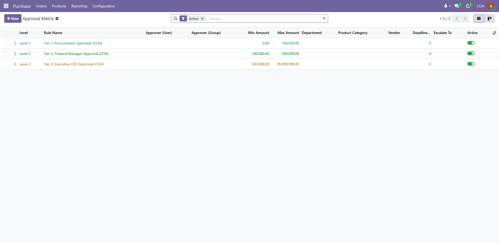
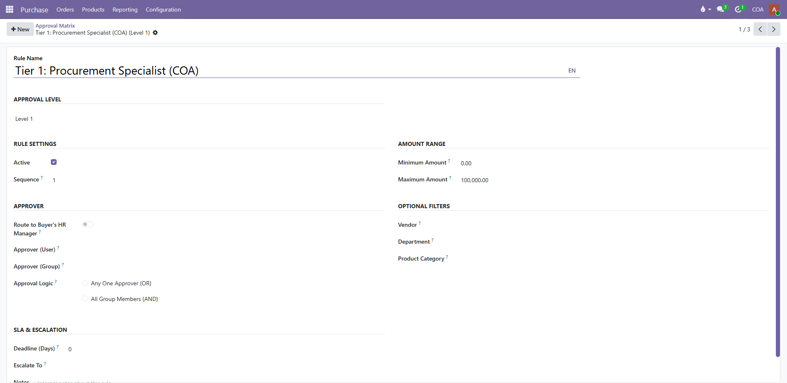
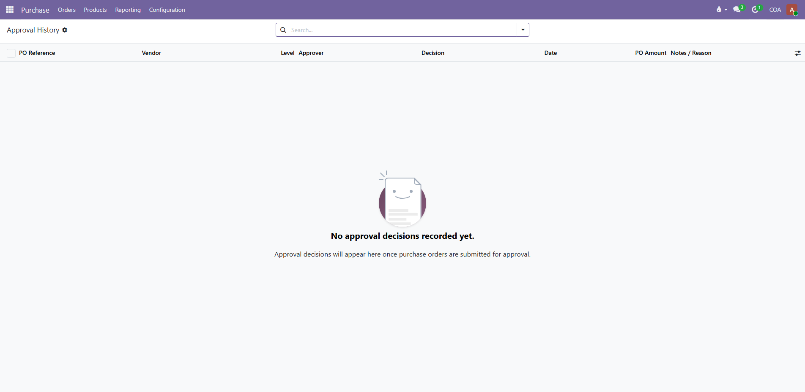

  
  <h1>COA Purchase Approval Workflow | Odoo Procurement Governance</h1>
  
<strong>Multi-Tier Purchase Order Approval Workflow with Spending Limits, SLA Escalation, and Audit Trails</strong>

  

    
    
    
    
  

---

## Overview

**COA Purchase Approval Workflow** is an enterprise-grade procurement governance app built for Odoo 19, 18, and 17. It empowers purchasing departments, financial controllers, and executive leadership to implement strict, multi-tiered spending limits and approval matrices for Purchase Orders (POs) and Requests for Quotation (RFQs).

With built-in SLA deadline tracking, automatic escalation, mobile one-click email approvals, out-of-office delegation, and comprehensive PDF/Excel audit reports, your procurement cycle remains fast, compliant, and completely transparent.

---

## Key Features

- **Multi-Tier Spending Thresholds:**
  - Configure unlimited approval levels per department or subsidiary (e.g. Lead &le; $10k, Director &le; $50k, CFO &gt; $50k).
- **SLA Deadlines & Automatic Escalation:**
  - Define response windows for each signatory. Unapproved orders automatically escalate to superiors via automated cron jobs.
- **One-Click Mobile Email Approval:**
  - Managers can sign off or refuse purchase orders directly from notification emails on mobile with encrypted single-use tokens.
- **Out-of-Office & Vacation Delegation:**
  - Temporarily transfer approval rights to designated colleagues during leaves with start and end date controls.
- **Trusted Vendor Fast-Track:**
  - Bypass multi-level approvals for certified vendors below configurable spending ceilings.
- **Real-Time Budget Control Warnings:**
  - Displays remaining budget allocations and overspending alerts directly on the purchase approval screen.
- **Comprehensive Audit Trail:**
  - Full time-stamped history of every submission, approval, refusal note, and delegation, exportable to Excel or branded PDF reports.
- **Bilingual Interface:** Fully localized in English (`en_US`) and Arabic (`ar_001`).

---

## Application Previews

### 1. Purchase Approval Matrices Overview

### 2. Detailed Approval Tier Form & Spending Rules

### 3. Complete Purchase Order Approval History & Audit Trail

---

## Installation & Configuration

1. Place the `purchase_approval_workflow` directory into your Odoo custom addons path.
2. Update the Apps list in Odoo developer mode.
3. Install **COA Purchase Approval Workflow**.
4. Navigate to **Purchase > Configuration > Approval Matrices** to define your organization's spending thresholds and approver tiers.

---

## Technical Support & Contact

- **Author:** Community of Accountants (COA-Egypt)
- **Website:** [https://www.coa-egy.com](https://www.coa-egy.com)
- **Email:** [info@coa-egy.com](mailto:info@coa-egy.com)
